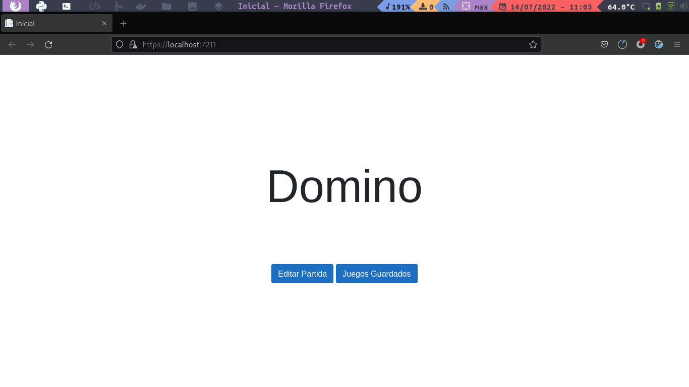
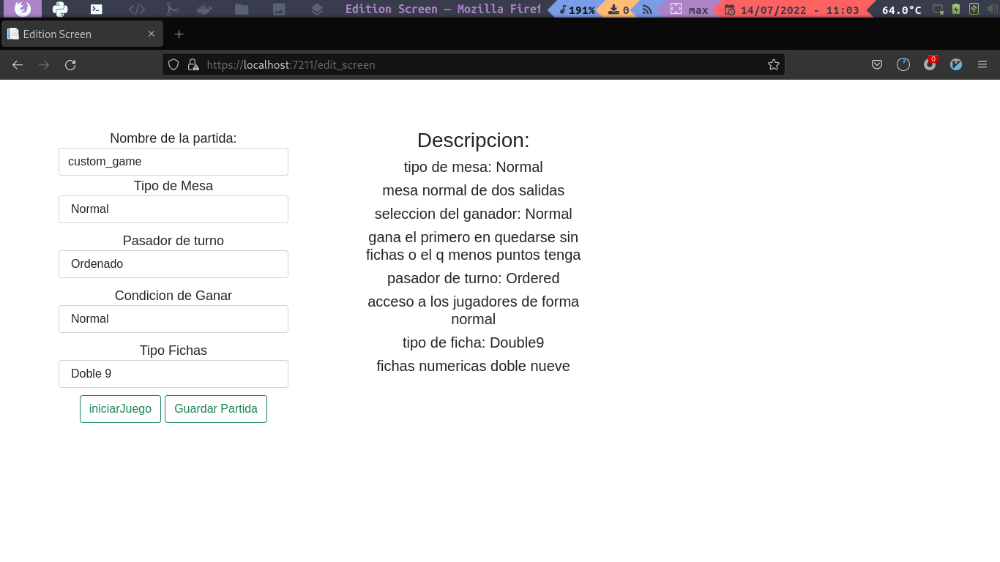
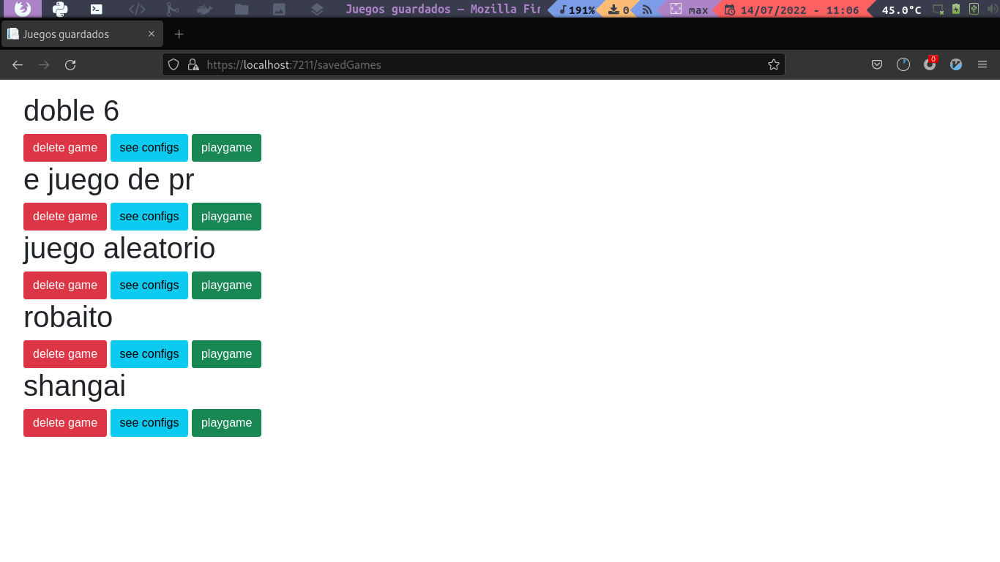
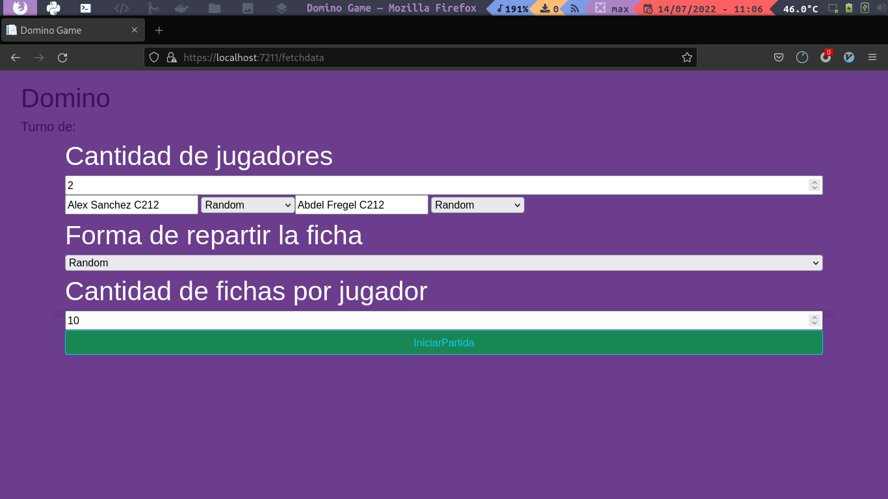
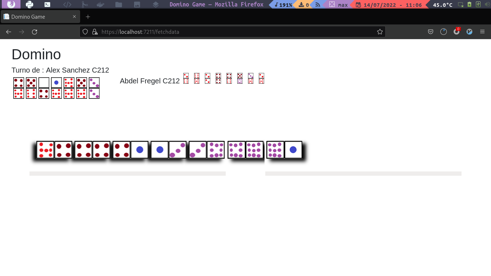

# Multi-Domino

 >Proyecto de Programación II. Facultad de Matemática y Computación. Universidad de La Habana. Curso 2022.

 ## Dependencias
   - dotnet 6 o superior 
   - blazor 

 ## Como ejecutar el proyecto
    blazor:
    ejecutando el comando make run
    o el comando  dotnet watch run --project Domino   
    version de consola:
     make console
    o el comando  dotnet watch run --project ConsoleApp   

## Como funciona ?
     - al abrir el navegador comenzara el menu 
 

    - el boton de edicion , te llevara al menu donde puedes editar el tipo de partida que quieres jugar

  

       - a la derecha estara la descripcion del tipo de juego que se esta seleccionando
       - a la izquierda estan los parametros de edicion
       - el boton de 
      - el boton de partidas guardadas lleva a una pantalla donde podras seleccionar una partida pre-creada

  

     -en la pantalla de juego podras seleccionar la cantidad de jugadores asi como los nombres y tipo de jugador que sera cada uno , asi como la cantidad de fichas que tendran y la forma en que estas se reparten

  

    - despues de seleccionados todos los parametros el juego comenzara 
         
  
